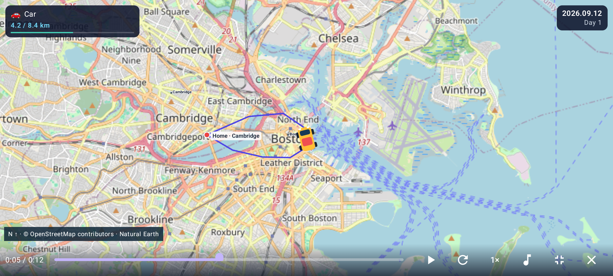
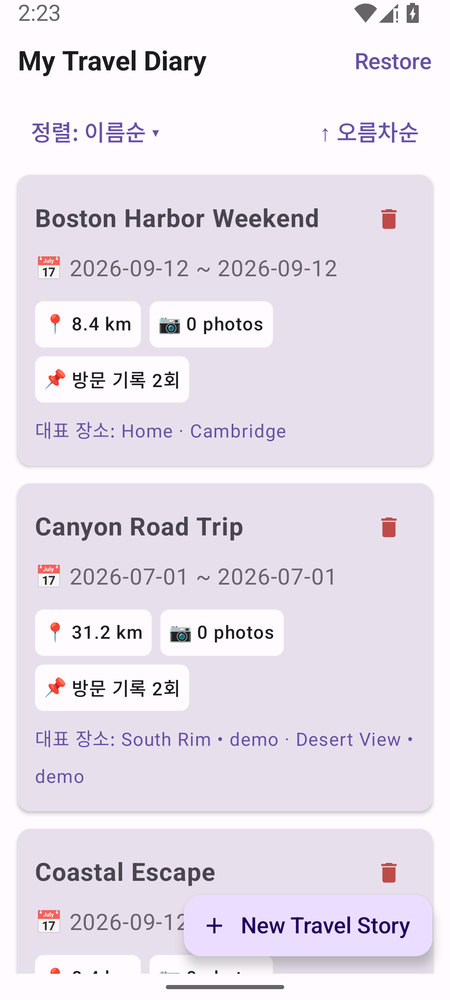
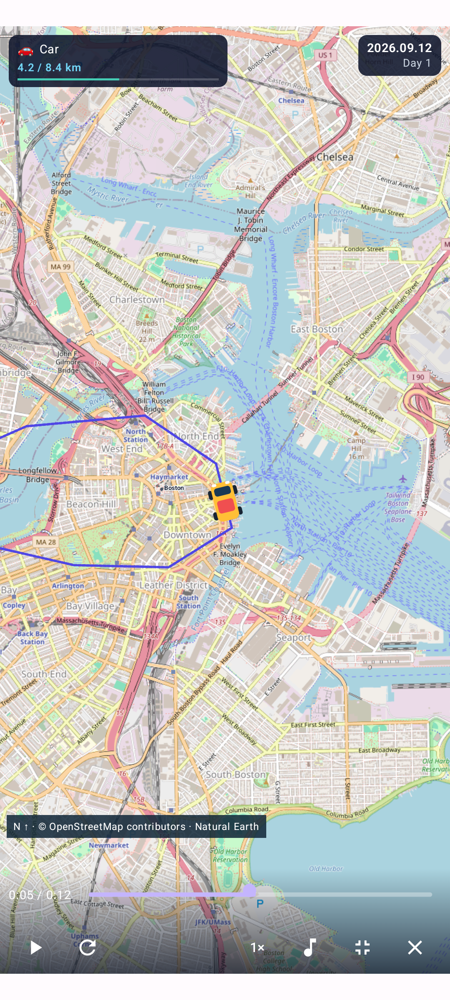
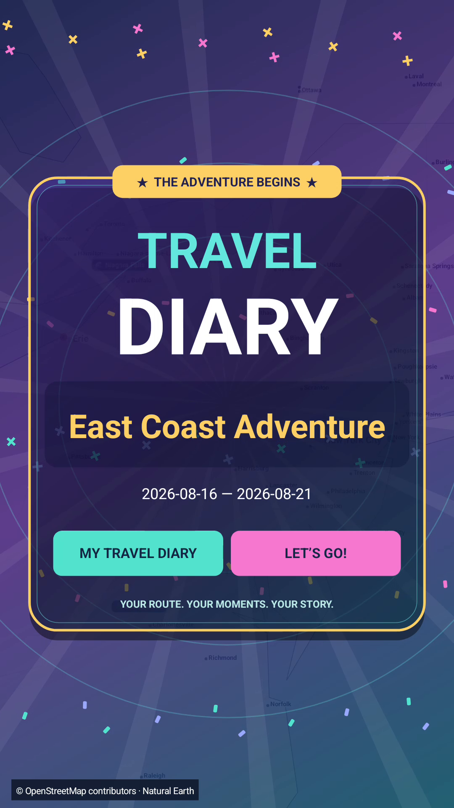
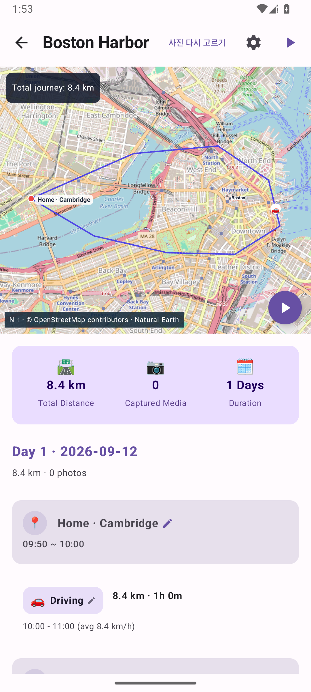

# My Travel Diary

**[한국어](README.md)** · **English**

### Watch your travels come to life again.

The roads you followed. The photos you took along the way. **My Travel Diary** brings your Google Maps Timeline history and phone photos together in an **animated 2D travel diary and a video you can share**.

A little car following your route, a plane crossing the sky, a pause to enjoy a favorite photo. Rediscover your trip, one moment at a time.

**[📥 Download for Android](https://github.com/HyeokjaeKwon26/My-Travel-Diary/releases/tag/v1.1.0-rc1)** · **[First-time user guide](docs/USER_GUIDE.en.md)** · **[Feedback & issues](https://github.com/HyeokjaeKwon26/My-Travel-Diary/issues)**

Android 8.0+ · Phones & tablets · Current public version: **1.1.0-rc1 (prerelease)**

*A Boston demo running in the app. Its illustrative route showcases features; it is not a recorded journey or a navigation route.*

*The map screenshots show optional Internet street detail enabled. It is off by default; enable it in map settings.*

## Your trip, with a little more life

- **Make the journey part of the memory.** Cars, trains, planes, boats, and other travel modes become playful 2D characters with clear directions. A KTX-inspired train and small animated movements add personality to the ride.
- **Remember the place behind each photo.** Browse visits and photos by day. Photos keep their original proportions, and the journey briefly pauses to show photos taken on the move.
- **Let the app choose—or pick your own favorites.** Automatic photo analysis selects moments for your story. You can choose representative photos yourself, and saved selections are reused when you reopen the trip.
- **Enjoy the view, then jump to any moment.** Watch in fullscreen or landscape, check elapsed and total time, seek, or change speed. Controls fade away while playing and return with a tap.
- **Turn your trip into a video.** Create an MP4 with colorful opening and closing cards, your route, photos, and optional music. Save a portrait or landscape video and share it with family and friends.
- **Find old adventures easily.** Sort by name, creation order, or travel date. Each trip card shows distance, photo count, and visit records.

## See it in action

| Your travel collection | Fullscreen journey playback | An exported video's opening card |
| :---: | :---: | :---: |
|  |  |  |

*Actual app screens and an exported video frame using example trips. Some labels in these screenshots are Korean. Layout and fonts may vary with device settings.*

### Smaller controls. More room for your trip.

After about three seconds without interaction, playback controls fade away. Tap the map once to bring them back. They stay visible while paused or while you move the seek bar. On wide landscape screens, they fit into one compact row.

## Try a trip before importing anything

You do not need personal location history or photos to try the demo.

1. Install the app and tap **+ New Travel Story**.
2. Choose **Try Grand Canyon • illustrative route**.
3. Tap **▶ inside the map** to start. Use the fullscreen button on the playback controls for a bigger view.

## Create a trip → relive it → keep it as a video

### 1. Choose your travel history and dates

Have a **JSON file exported from Google Maps Timeline** and your **trip photos on your phone** ready. JSON is simply the file containing your location history; you do not need to open or edit it.

**Get the JSON file — on Galaxy and other Android devices**

1. On the phone holding your travel history, open **Settings**.
2. Go to **Location → Location services → Timeline**.
3. Choose **Export Timeline data → Continue**.
4. Save to an easy-to-find folder such as **Downloads**, and wait for export to finish.
5. In My Travel Diary, choose **+ New Travel Story → Choose Timeline JSON File** and select the **`.json` file** you just saved.

Menu names can vary by device. For missing menus or empty history, see [preparation and troubleshooting](docs/USER_GUIDE.en.md#timeline-export). The export steps follow [Google's official instructions](https://support.google.com/maps/answer/6258979?co=GENIE.Platform%3DAndroid&hl=en).

**No need to zip or upload your photos.** Keep the original trip photos on your phone, then tap **Enable** on the new-trip screen to allow photo access. If you allow only selected photos, only those can be included. Download any photos stored only in Google Photos or another cloud service to your device first.

Choose **+ New Travel Story → Choose Timeline JSON File**, give the trip a name, and select the first and last days on the calendar. Allow access to the photos you want to use, then tap **Reconstruct Travel Story**. Progress and estimated time remaining appear during preparation.

### 2. Follow your memories along the route

Open a trip card and press play on the map. North stays at the top while the view follows your journey and automatically adjusts its scale. The date and trip day stay on screen.

Tap a photo to view it, then choose **Use as Representative Photo** to feature a favorite. Use **사진 다시 고르기** (“Choose photos again”) to refresh automatic selections.

### 3. Make a video your way

Tap **▶ to the right of the trip title** to open video export. This is separate from the play button inside the map.

Choose the story length, portrait or landscape, resolution, and music, then tap **Create Travel Video**. When it is ready, use **Play Preview**, **Save Video** to save to your gallery, or **Share**.

| What you want | Suggested setting |
| --- | --- |
| Watch or share vertically on a phone | Portrait 9:16 |
| Watch on a tablet or wider screen | Landscape 16:9 |
| Make your first video | Standard Story + 720p |
| Keep a sharper version | 1080p — may fall back to 720p on some devices |

**[Full guide: installation, photos, map settings, and backups →](docs/USER_GUIDE.en.md)**

## Common questions

**Can I delete the original photos and still see them in my trip?**

Please keep the originals. The app saves which photos it selected, but does not make separate copies of the image files. Deleting an original makes that photo unavailable in the diary. An MP4 already saved to your gallery contains the photo frames and remains playable without the originals.

**Do I need an internet connection?**

A basic map is included. Internet street detail is off by default; enable it in Map settings to request roads and labels for the visible map over Wi-Fi or mobile data. Cached detail can be reused, but the app does not include detailed offline maps of the whole world. No terrain data is downloaded. Video export uses maps already available on your phone and falls back to the basic map where detail is missing.

**Does it work on phones and tablets?**

The layout adapts to Android phones and tablets. Both live journeys and saved videos support fullscreen and landscape viewing. This is currently a prerelease; playback performance and export time vary by device. There is no iPhone app.

**Are my photos and location history uploaded?**

Trip processing, photo analysis, and video creation happen on your phone. The app does not upload your original photos or Timeline file. Map requests use the network, and the photo-analysis SDK may send usage diagnostics. See [privacy and data handling](docs/PRIVACY.md).

## Creator & project

**Hyeokjae Kwon, M.D., Ph.D.**

[Website](https://hyeokjaekwon26.github.io/) · [GitHub](https://github.com/HyeokjaeKwon26)

An upgraded 2D edition of My Travel Diary that keeps your existing trips and brings the photo, playback, and video improvements from the 3D edition to a flat map. For terrain in 3D, see the separate [My Travel Diary 3D app](https://github.com/HyeokjaeKwon26/My-Travel-Diary-3D).

## Disclaimer · Before you use the app

- **This app is for reliving trips.** Maps, place names, and detected travel modes can be inaccurate. Gap connections and character movements include estimates and artistic effects. Do not use them for navigation or as proof of an exact location.
- **Keep your originals and backups.** Saved photo selections and journey backups do not contain copies of original photos. Deleting originals, changing permissions, or uninstalling the app can make photos or trip records unavailable.
- **Review videos before sharing.** Generalizing place names does not hide routes, map labels, or private information inside photos. Map requests can use network data.
- **This is a prerelease.** Playback and export performance vary by device. Warranty and liability terms are in sections 15–17 of the [AGPL-3.0 license](LICENSE).

**[Full Disclaimer — English / 한국어](DISCLAIMER.md#english)** · **[Privacy and data handling](docs/PRIVACY.md)**

---

### More to explore

**[Installation & user guide](docs/USER_GUIDE.en.md)** · **[Downloads & release news](https://github.com/HyeokjaeKwon26/My-Travel-Diary/releases)** · **[Feedback & issues](https://github.com/HyeokjaeKwon26/My-Travel-Diary/issues)**

Maps: © [OpenStreetMap contributors](https://www.openstreetmap.org/copyright), Natural Earth. Sources and licenses: [maps](docs/BASEMAP_SOURCE.md) · [music](docs/MUSIC_LICENSES.md) · [AGPL-3.0](LICENSE).

For build instructions and technical details, see the **[developer guide](docs/DEVELOPMENT.md)**.
